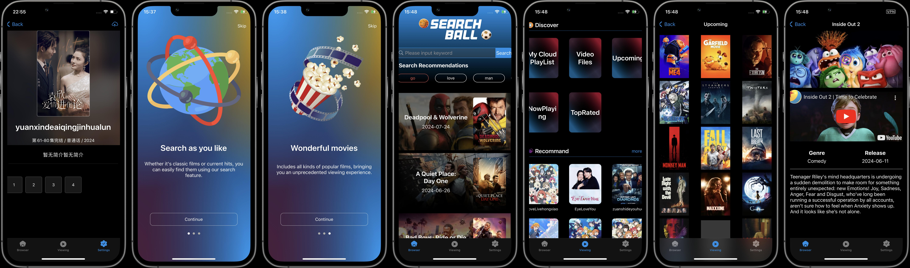
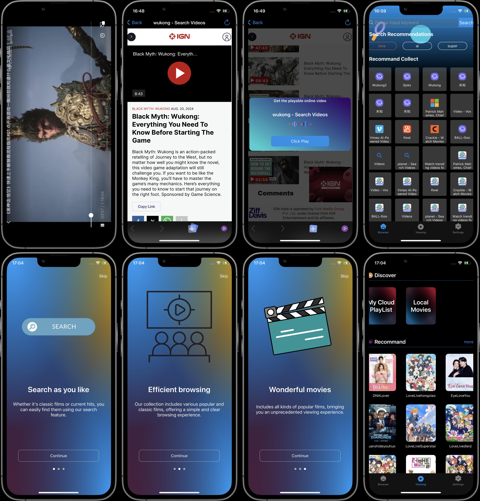

# SOUQIUBA SDKVideoPlayer for iOS

[](https://swift.org/)
[](https://developer.apple.com/ios/)
[](https://github.com/Carthage/Carthage)

`SDKVideoPlayer` is a feature-rich video player for iOS applications developed using Swift. It provides a seamless video playback experience with a focus on customization and ease of use.

## Features

- Fullscreen and inline playback support.
- Play videos from various sources (URL, local files, and network streams).
- Customizable controls and UI elements.
- Support for subtitles and closed captions.
- Picture-in-Picture support.
- AirPlay compatibility.
- External display support.

## Requirements

- iOS 13.0+
- Xcode 11+
- Swift 5.0+

## Installation

```shell
pod install
```
Note: The pod install command may take some time to complete, especially if this is the first time running it on your project or if there have been updates to the CocoaPods repositories. Please be patient during this process as it sets up the necessary dependencies for your project.

Once the installation is complete, open the .xcworkspace file to launch your project in Xcode.

### CocoaPods

To install `SDKVideoPlayer` using CocoaPods, add the following line to your `Podfile`:

```ruby

# Uncomment the next line to define a global platform for your project
 platform :ios, '13.0'

target 'SDKVideoPlayer' do
  # Comment the next line if you don't want to use dynamic frameworks
  use_frameworks!

  # Pods for SDKVideoPlayer
  
  pod 'SwiftIcons', '~> 3.0'
  
  pod 'FirebaseCrashlytics'
  
  
#---------- from github
  pod 'Libass', :git => 'https://github.com/nicolastinkl/FFmpegKit', :branch => 'main'
  pod 'Libmpv', :git => 'https://github.com/nicolastinkl/FFmpegKit', :branch => 'main'
  pod 'FFmpegKit', :git => 'https://github.com/nicolastinkl/FFmpegKit', :branch => 'main'

#---------- from local folder
#  pod 'Libass', :path => '/Users/abc123456/Documents/ios/FFmpegKit'
#  pod 'Libmpv', :path => '/Users/abc123456/Documents/ios/FFmpegKit'
#  pod 'FFmpegKit', :path => '/Users/abc123456/Documents/ios/FFmpegKit'


#  pod 'DisplayCriteria', :path => './KSPlayer/'
#  pod 'SwiftLoader', :path => './SwiftLoader/'
#  pod 'KSPlayer' , :path => './KSPlayer/'
#  pod 'SwiftWebVC'


  target 'SDKVideoPlayerTests' do
    inherit! :search_paths
    # Pods for testing
  
  end

  target 'SDKVideoPlayerUITests' do
    # Pods for testing
  end

end

```

## Aug 5st update new features
1 ：优化 UI，增加电影浏览功能
2 ：可以支持 youtube 在线浏览电影简介
3 : 修复 bug


 1. 修复本地文件无法播放的问题 
 2. 修复加载提示退出不转动的问题
 3. 修复数据问题，确保可以加载成功


2018-8-21 Change-log:
 1. 更新首页内容
 2. 主要突出wukong 主题视频
 3. 去掉多余的代码



